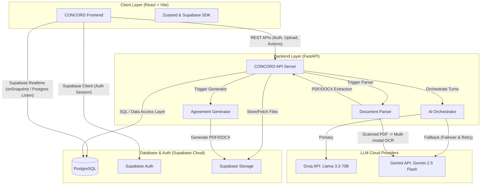

# CONCORD: AI-Mediated Contract Negotiation Platform

> "Where agreement is engineered."

CONCORD is a production-ready, AI-mediated contract negotiation platform where autonomous agents represent each party's interests, negotiate within private constraints, explain every concession using commercial logic, and require human approval before finalization.

---

## 1. System Architecture



---

## 2. Zero-Cost Tech Stack Justifications ($0/Month)

1.  **Frontend**: React (Vite) + Tailwind CSS + Framer Motion. Zero-cost deployment on Vercel/Netlify. High-performance, lightweight, and completely static.
2.  **Backend**: FastAPI (Python). Async orchestrator optimized for LLMs. Deployed on Render Free Tier or Google Cloud Run (always-free container executions).
3.  **Database & Auth**: Supabase (PostgreSQL). Generous free tier containing PostgreSQL, email/password Auth, Storage for contract PDF uploads, and Realtime Listeners (Postgres write broadcasts) to support live "watch it happen" views.
4.  **AI Layer**: Groq Cloud (Llama 3.3 70B) for ultra-fast, zero-cost structured function calling, with automatic failover to Gemini 2.5 Flash (Google AI Studio) free tier.

---

## 3. Database Schema setup (Supabase SQL Editor)

Paste and execute the following SQL script into the Supabase SQL Editor to set up your tables and security policies:

```sql
-- 1. Profiles (Linked to Supabase Auth)
CREATE TABLE public.profiles (
    id UUID PRIMARY KEY REFERENCES auth.users(id) ON DELETE CASCADE,
    email TEXT UNIQUE NOT NULL,
    full_name TEXT,
    created_at TIMESTAMP WITH TIME ZONE DEFAULT timezone('utc'::text, now()) NOT NULL
);

ALTER TABLE public.profiles ENABLE ROW LEVEL SECURITY;
CREATE POLICY "Allow public read access to profiles" ON public.profiles FOR SELECT USING (true);
CREATE POLICY "Allow users to update own profile" ON public.profiles FOR UPDATE USING (auth.uid() = id);

-- 2. Negotiation Sessions
CREATE TABLE public.negotiation_sessions (
    id UUID PRIMARY KEY DEFAULT gen_random_uuid(),
    title TEXT NOT NULL,
    status TEXT NOT NULL CHECK (status IN ('draft', 'awaiting_second_party', 'ready', 'negotiating', 'awaiting_approval', 'completed', 'rejected', 'expired')),
    creator_id UUID REFERENCES public.profiles(id) NOT NULL,
    party_a_id UUID REFERENCES public.profiles(id),
    party_b_id UUID REFERENCES public.profiles(id),
    current_turn TEXT CHECK (current_turn IN ('party_a', 'party_b', 'mediator', 'none')),
    round_count INTEGER DEFAULT 0 NOT NULL,
    max_rounds INTEGER DEFAULT 12 NOT NULL,
    created_at TIMESTAMP WITH TIME ZONE DEFAULT timezone('utc'::text, now()) NOT NULL,
    updated_at TIMESTAMP WITH TIME ZONE DEFAULT timezone('utc'::text, now()) NOT NULL
);

ALTER TABLE public.negotiation_sessions ENABLE ROW LEVEL SECURITY;
CREATE POLICY "Allow members access to session" ON public.negotiation_sessions
    FOR ALL USING (auth.uid() = creator_id OR auth.uid() = party_a_id OR auth.uid() = party_b_id);

-- 3. Party Constraints (Private Constraints - RLS enforced!)
CREATE TABLE public.party_constraints (
    id UUID PRIMARY KEY DEFAULT gen_random_uuid(),
    session_id UUID REFERENCES public.negotiation_sessions(id) ON DELETE CASCADE NOT NULL,
    party_id UUID REFERENCES public.profiles(id) NOT NULL,
    role TEXT NOT NULL CHECK (role IN ('party_a', 'party_b')),
    raw_text TEXT,
    structured_constraints JSONB NOT NULL DEFAULT '{}'::jsonb,
    is_ready BOOLEAN DEFAULT false NOT NULL,
    created_at TIMESTAMP WITH TIME ZONE DEFAULT timezone('utc'::text, now()) NOT NULL,
    updated_at TIMESTAMP WITH TIME ZONE DEFAULT timezone('utc'::text, now()) NOT NULL,
    UNIQUE(session_id, role)
);

ALTER TABLE public.party_constraints ENABLE ROW LEVEL SECURITY;
CREATE POLICY "Users can only access own constraints" ON public.party_constraints
    FOR ALL USING (auth.uid() = party_id);

-- 4. Negotiation Logs (Append-Only Audit Trail)
CREATE TABLE public.negotiation_logs (
    id UUID PRIMARY KEY DEFAULT gen_random_uuid(),
    session_id UUID REFERENCES public.negotiation_sessions(id) ON DELETE CASCADE NOT NULL,
    round INTEGER NOT NULL,
    sender TEXT NOT NULL CHECK (sender IN ('party_a', 'party_b', 'mediator', 'system')),
    tool_called TEXT NOT NULL CHECK (tool_called IN ('propose_term', 'accept_term', 'counter_propose', 'request_concession', 'escalate_to_mediator', 'system_start', 'system_end')),
    term TEXT,
    value TEXT,
    reasoning TEXT NOT NULL,
    created_at TIMESTAMP WITH TIME ZONE DEFAULT timezone('utc'::text, now()) NOT NULL
);

ALTER TABLE public.negotiation_logs ENABLE ROW LEVEL SECURITY;
CREATE POLICY "Session members read logs" ON public.negotiation_logs
    FOR SELECT USING (true);

-- 5. Agreed Terms (State of the Agreement)
CREATE TABLE public.agreed_terms (
    id UUID PRIMARY KEY DEFAULT gen_random_uuid(),
    session_id UUID REFERENCES public.negotiation_sessions(id) ON DELETE CASCADE NOT NULL,
    term TEXT NOT NULL,
    value TEXT NOT NULL,
    status TEXT NOT NULL CHECK (status IN ('agreed', 'pending', 'unresolved')),
    last_modified_by TEXT NOT NULL CHECK (last_modified_by IN ('party_a', 'party_b', 'mediator')),
    version INTEGER DEFAULT 1 NOT NULL,
    created_at TIMESTAMP WITH TIME ZONE DEFAULT timezone('utc'::text, now()) NOT NULL,
    updated_at TIMESTAMP WITH TIME ZONE DEFAULT timezone('utc'::text, now()) NOT NULL,
    UNIQUE(session_id, term)
);

ALTER TABLE public.agreed_terms ENABLE ROW LEVEL SECURITY;
CREATE POLICY "Session members read agreed terms" ON public.agreed_terms
    FOR SELECT USING (true);

-- 6. Agreement Versions
CREATE TABLE public.agreement_versions (
    id UUID PRIMARY KEY DEFAULT gen_random_uuid(),
    session_id UUID REFERENCES public.negotiation_sessions(id) ON DELETE CASCADE NOT NULL,
    version INTEGER NOT NULL,
    terms_snapshot JSONB NOT NULL,
    created_by UUID REFERENCES public.profiles(id) NOT NULL,
    status TEXT NOT NULL CHECK (status IN ('draft', 'signed')),
    pdf_url TEXT,
    docx_url TEXT,
    created_at TIMESTAMP WITH TIME ZONE DEFAULT timezone('utc'::text, now()) NOT NULL
);

ALTER TABLE public.agreement_versions ENABLE ROW LEVEL SECURITY;
CREATE POLICY "Session members read versions" ON public.agreement_versions
    FOR SELECT USING (true);
```

### 3.1 Email Rate Limit Bypass (Recommended for Testing)

To prevent getting blocked by Supabase's default email SMTP rate limit during signups, it is **highly recommended** to disable email confirmations in your Supabase project:

1.  Go to your **Supabase Project Dashboard**.
2.  Navigate to **Authentication** (sidebar) -> **Providers** -> **Email**.
3.  Turn **OFF** the toggle for **Confirm Email** (double opt-in).
4.  Click **Save**.

This allows new test accounts to sign up and log in instantly without waiting for or sending confirmation emails.

---

## 4. Local Development Setup

### 4.1 Backend Setup (`concord-backend`)
1.  Navigate to folder:
    ```bash
    cd concord-backend
    ```
2.  Set up env configuration:
    Copy `.env.example` to `.env` and fill in your Supabase details, Groq Key, and Gemini Key.
3.  Activate environment and run:
    ```bash
    venv\Scripts\activate
    py -m uvicorn app.main:app --reload
    ```
4.  Verify server is running by visiting `http://localhost:8000/`.

### 4.2 Frontend Setup (`concord-frontend`)
1.  Navigate to folder:
    ```bash
    cd concord-frontend
    ```
2.  Set up env configuration:
    Copy `.env.example` to `.env` and fill in the values:
    ```env
    VITE_SUPABASE_URL=https://your-project-id.supabase.co
    VITE_SUPABASE_ANON_KEY=your-anon-public-key
    VITE_API_URL=http://localhost:8000
    ```
3.  Run the application:
    ```bash
    npm run dev
    ```
4.  Open `http://localhost:5173/` in your browser.
